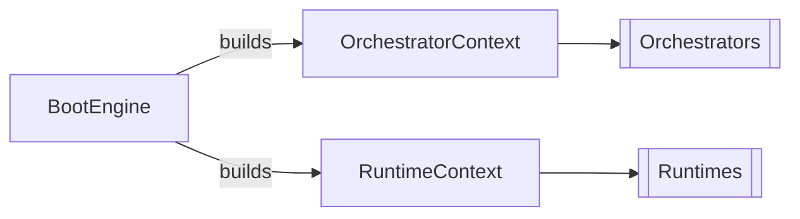
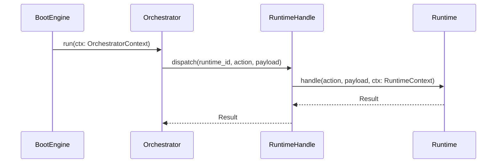

[[Context]] is the contract between layers. It defines what each participant can see and touch. [[Rind]] has two primary context types: one for [[Orchestrators]] during boot, one for [[Runtimes]] during action dispatch.





## OrchestratorContext

Given to orchestrators during `preload()` and `run()`.

```rust
pub struct OrchestratorContext<'a> {
    pub context_id: usize,
    pub metadata: &'a mut MetadataRegistry,
    pub instances: &'a mut InstanceMap,
    pub runtime: &'a RuntimeHandle,
    pub resources: &'a mut Resources,
}
```

| Field        | Purpose                                                           |
| ------------ | ----------------------------------------------------------------- |
| `context_id` | Unique ID for this boot cycle-phase pair                          |
| `metadata`   | Registry of all unit [[Entities#Metadata\|Metadata]]              |
| `instances`  | Map of string identifiers to unit instances                       |
| `runtime`    | [[Runtimes#RuntimeHandle\|RuntimeHandle]] for dispatching actions |
| `resources`  | Shared resource pool                                              |


## RuntimeContext

Given to runtimes during `handle()`.

```rust
pub struct RuntimeContext<'a> {
    pub runtime_id: &'a str,
    pub scope: &'a mut RuntimeScope,
    pub registry: InstanceRegistry<'a>,
    pub resources: &'a mut Resources,
    pub event_bus: &'a mut EventBus,
    pub lifecycle: &'a mut LifecycleQueue,
    pub notifier: Option<Notifier>,
}
```

| Field        | Purpose                                                                                |
| ------------ | -------------------------------------------------------------------------------------- |
| `runtime_id` | The id of the runtime being dispatched to                                              |
| `scope`      | [[#RuntimeScope]] instance for scoped stores                                           |
| `registry`   | [[Registry#InstanceRegistry|InstanceRegistry]] for looking up and mutating instances    |
| `resources`  | Mutable reference to shared [[Resources]] (FD-based resource manager)                   |
| `event_bus`  | [[#EventBus]] publisher for lifecycle and custom events                                |
| `lifecycle`  | [[#LifecycleQueue]] for requesting system-level actions (reboot, shutdown, etc.)        |
| `notifier`   | Optional [[#Notifier]] for eventfd-based wake-up signals                               |

## RuntimePayload

The payload carried with each action dispatch.

```rust
pub struct RuntimePayload(pub HashMap<Ustr, Box<dyn Any>>);

impl RuntimePayload {
    pub fn new() -> Self;
    pub fn get<T: Any>(&self, key: &str) -> Option<&T>;
    pub fn insert<T: Any>(&mut self, key: impl Into<Ustr>, value: T) -> Option<Box<dyn Any>>;
    pub fn remove(&mut self, key: &str) -> Option<Box<dyn Any>>;
    pub fn contains_key(&self, key: &str) -> bool;
}
```

A typed key-value bag. Runtimes pack and unpack payloads by name when dispatching actions to each other.


## RuntimeScope

[[#RuntimeScope|Runtime Scopes]] are injected into the `ScopeBuilder` by orchestrators during `build_scope()`. At dispatch time, each runtime receives the fully-built `Scope` via `RuntimeContext`.

```rust
// in an orchestrator
// private
builder.insert::<IpcSourcemap>("ipc-runtime", || ipcmap.clone());
// public
builder.globals(|scope| {
	scope.insert::<IpcSourcemap>(ipcmap.clone());
});

// in a runtime
let ipcsrc: Option<&IpcSourcemap> = ctx.scope.get::<IpcSourcemap>();
```

## Context Flow



Each context carries only what its recipient is entitled to see. Orchestrators don't get the event bus or lifecycle; runtimes don't get mutable metadata.


## EventBus

A type-safe publish/subscribe event bus. Runtimes subscribe to event types and receive them when emitted.

```rust
pub struct EventBus {
    inner: Rc<RefCell<EventBusInner>>,
}

impl EventBus {
    pub fn new(notifier: Option<Notifier>) -> Self;
    pub fn subscribe<T: Clone + Send + 'static>(&self) -> Subscription<T>;
    pub fn emit<T: Clone + Send + 'static>(&self, event: T);
}

pub struct Subscription<T> {
    rx: Receiver<T>,
}

impl<T> Subscription<T> {
    pub fn try_recv(&self) -> Option<T>;
    pub fn drain(&self) -> Vec<T>;
    pub fn recv(&self) -> Option<T>;
}
```

## LifecycleQueue

A queue for requesting system-level lifecycle actions. Runtimes push actions; the boot engine processes them.

```rust
pub enum LifecycleAction {
    ReloadUnits,
    SoftReboot,
    Reboot,
    Shutdown,
}

pub struct LifecycleQueue {
    inner: Rc<RefCell<VecDeque<LifecycleAction>>>,
}

impl LifecycleQueue {
    pub fn request(&self, action: LifecycleAction);
    pub fn next(&self) -> Option<LifecycleAction>;
}
```


## Notifier

An `eventfd`-based notification mechanism for waking up the epoll loop from any thread.

```rust
pub struct Notifier {
    fd: Arc<OwnedFd>,
}

impl Notifier {
    pub fn new() -> Result<Self>;
    pub fn as_raw_fd(&self) -> RawFd;
    pub fn notify(&self) -> Result<Void>;
    pub fn reset(&self) -> Result<Void>;
}
```


See also: [[Boot]], [[Orchestrators]], [[Runtimes]], [[Scopes]]
