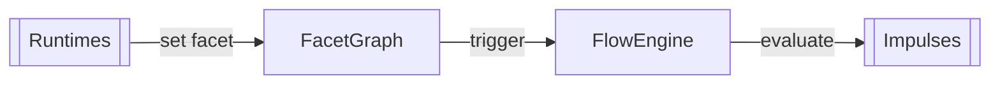

[[Facets]] describe what the system *is* at any moment, [[Persistence|persistent]], [[reactivity| reactive]] and [[Branching|branchable]]. They're named values in the [[Flow#FacetGraph|FacetGraph]] that any service can read, any trigger can match, and any transport can stream. If you need to know something about the system, it's a facet.





## Facet as Concept

A facet answers "what is the current value of X?".

Examples:

- `service:httpd_status` → `"running"`
- `network:eth0_address` → `"192.168.1.10"`
- `system:load` → `0.45`
- `session:makano` → `"active"`

If the system restarts, restored facets resume their last value.


## Facet in Flow Items

A flow item watches a facet pattern:

```toml
[[facet]]
name = "temp"
payload = "json"
branch = ["id"]
after = [{ facet = "sensor:online" }]
```

| Field          | Type   | Purpose                                                                                      |
| -------------- | ------ | -------------------------------------------------------------------------------------------- |
| `name`         | string | Unique facet name, `group:entity` convention                                                 |
| `payload`      | string | Payload type: `json` (default), `string`, `bytes`, `none`                                    |
| `after`        | array  | [[Architecture/Flow#FlowItem\|FlowItem]] conditions that activate this facet (transcendence) |
| `branch`       | array  | JSON key specs for branching (e.g. `["id"]`, `["seat:tty"]`)                                 |
| `stop-on`      | array  | Conditions that deactivate this facet (inverse transcendence)                                |
| `auto-payload` | table  | Automatic payload generation                                                                 |
| `subscribers`  | array  | Transport subscribers notified on change                                                     |
| `broadcast`    | array  | Named broadcast targets                                                                      |
| `permissions`  | array  | [[Permissions\|Permission]] names required to set this facet                                 |

## Branching

Facets can have multiple branch instances, keyed by JSON payload fields:

```toml
[[facet]]
name = "user_session"
payload = "json"
branch = ["tty"]          # one branch per unique tty value
```

When a payload `{"tty": "tty1", "username": "makano"}` is set, a branch `tty1` is created. Another with `{"tty": "tty2"}` creates a separate branch. Existing branches are merged (JSON deep-merge); new branches are appended.

## After: Transcendence

Facets can declare dependencies that activate them:

```toml
[[facet]]
name = "app_ready"
payload = "none"
after = [{ facet = "db:ready" }, { facet = "cache:ready" }]
```

When both `db:ready` and `cache:ready` are set, `app:ready` activates. When either is removed, `app:ready` deactivates. The [[Flow#FlowEngine|FlowEngine]] maintains transcendence and inverse-transcendence indexes for efficient dependency resolution.

## Stop-On: Inverse Transcendence

```toml
[[facet]]
name = "login_required"
payload = "json"
branch = ["tty"]
stop-on = ["rind:user_session"]
```

When `rind:user_session` has a branch for a given key, the corresponding `login_required` branch is automatically removed.

## Subscribers

Facet changes can be published over transport:

```toml
[[facet]]
name = "transport_state"
payload = "string"
subscribers = [{ id = "uds", options = ["detached=true"], permissions = ["any"] }]
```

When the facet is set or removed, a [[IPC#TransportMessage|TransportMessage]] is sent to each subscriber.

## Auto Payload

Automatic payload generation:

```toml
[[facet]]
name = "generated"
payload = "string"
auto-payload = { eval = "/usr/bin/sensor-read" }
```

## Setting Facets

Facets are set via runtime dispatch, [[IPC]] messages, or [[Architecture/Flow#EmitTrigger|Trigger]] actions:

```toml
[[service]]
name = "reporter"
run.exec = "/usr/bin/reporter"
on-start = [{ facet = "status", payload = "running" }]
```

## Facet Impermanence
Facets can be impersistent if their name ends with `!`, marking them as [[Persistence#Transience|transient]] but not persistent. (e.g. `net:configured!`, `rind:up!`)


See also: [[Flow]], [[Impulses]], [[Persistence]], [[Architecture/Boot|Boot]]
