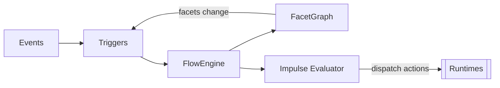

[[Flow]] is the core of [[Reactivity]] and [[Persistence]] in [[Rind]] as watches events, evaluates conditions against [[Facets]] (what the system *is*), and emits [[Impulses]] (what the system *does*). It's the if-this-then-that of the system.





## FlowInstance

Each unit of type `Flow` produces one `FlowInstance`. A `FlowInstance` is a separate instance that holds raw data of a [[#FlowItem]].

```rust
pub struct FlowInstance {
    pub name: Ustr,
    pub payload: FlowPayload,
    pub r#type: FlowType,
}
```

Where `FlowType` distinguishes between facets and impulses:

```rust
pub enum FlowType {
    Impulse,
    Facet,
}
```


## FlowItem

A small description of a flow item.

```toml
# just a name
start-on = ["rind:user_session"]

# specify facet or impulse with optional match
start-on = [{ facet = "rind:user_session" }, { impulse = "net:ready" }]
```


```rust
#[serde(untagged)]
pub enum FlowItem {
    Simple(Ustr),
    Detailed {
        facet: Option<Ustr>,
        impulse: Option<Ustr>,
        target: Option<FlowMatchOperation>,
        branch: Option<FlowMatchOperation>,
    },
}
```

## FlowPayload
The data that a flow item can hold, such as `json`, `string` or `none`.

```rust
let payload: FlowPayload = FlowPayload::Json(FlowJson::from_string(...));
```

## Matching

Matching conditions of a flow payload.

```rust
#[serde(untagged)]
pub enum FlowMatchOperation {
    Eq(Ustr),                            // exact match
    Options {
        binary: Option<bool>,            // match any bytes
        contains: Option<Ustr>,          // substring match
        r#as: Option<serde_json::Value>, // JSON subset match
    },
}
```

## FacetGraph

The state store. Facets are named key-value pairs, separated by [[Scopes]] and stored on disk for [[Persistence]].

```rust
pub struct FacetGraph {
    pub facets: HashMap<Ustr, Vec<FlowInstance>>,
    persistence: StatePersistence,
    persistence_root: PathBuf,
    scoped_persistence: HashMap<Ustr, StatePersistence>,
}
```

```rust
impl FacetGraph {
    pub const KEY: &str = "runtime:facet_graph";
    pub fn from_persistence(persistence: StatePersistence) -> Self;
    pub fn load_from_persistence(&mut self) -> Result<Void>;
    pub fn load_scope_from_persistence(&mut self, scope: &str) -> Result<Void>;
    pub fn drop_scope(&mut self, scope: &str) -> Result<Void>;
    pub fn save_all_scopes(&mut self) -> Result<Void>;
    pub fn snapshot_for_persistence(&self) -> StateSnapshot;
}
```


## Trigger

```toml
on-start = [
    { impulse = "notify:ready", payload = "online" },
    { timer = "healthcheck" },
    { facet = "status", payload = "running" },
    { service = "dependent", stop = true },
    { script = "/usr/bin/notify-ready.sh" },
    { exec = "/usr/bin/hook", args = ["arg1"] },
]
```


```rust
pub struct Trigger {
    pub script: Option<Ustr>,       // run shell command
    pub exec: Option<Ustr>,         // run executable
    pub args: Option<Vec<Ustr>>,    // arguments
    pub facet: Option<Ustr>,        // set a facet
    pub impulse: Option<Ustr>,      // emit an impulse
    pub service: Option<Ustr>,      // start/stop a service
    pub timer: Option<Ustr>,        // start/stop a timer
    pub socket: Option<Ustr>,       // start/stop a socket
    pub stop: Option<bool>,         // if true, stop instead of start
    pub payload: Option<Value>,     // json value
    pub action: Option<Ustr>,       // custom action name for runtime dispatch
}
```


## FlowRuntimePayload

A typed payload builder used when dispatching flow actions between runtimes.

```rust
pub struct FlowRuntimePayload<'a> {
    pub name: &'a str,
    pub payload: Option<serde_json::Value>,
    pub filter: Option<serde_json::Value>,
}
```

## FlowAction

Determines whether a flow event is being applied or reverted.

```rust
pub enum FlowAction {
    Apply,
    Revert,
}
```

## FlowEvent

Events emitted by the flow engine when facets or impulses change.

```rust
pub struct FlowEvent {
    pub name: Ustr,
    pub payload: serde_json::Value,
    pub action: FlowAction,
    pub flow_type: FlowEventType,
}

pub enum FlowEventType {
    Facet,
    Impulse,
}
```

## EmitTrigger

Serialized trigger dispatched over IPC for flow operations.

```rust
pub struct EmitTrigger {
    pub service: Option<Ustr>,
    pub name: Option<Ustr>,
    pub flow_type: Option<FlowType>,
    pub payload: Option<FlowPayload>,
    pub action: FlowAction,
    pub scope: Option<Ustr>,
}
```


See also: [[Facets]], [[Impulses]], [[Runtimes]]
