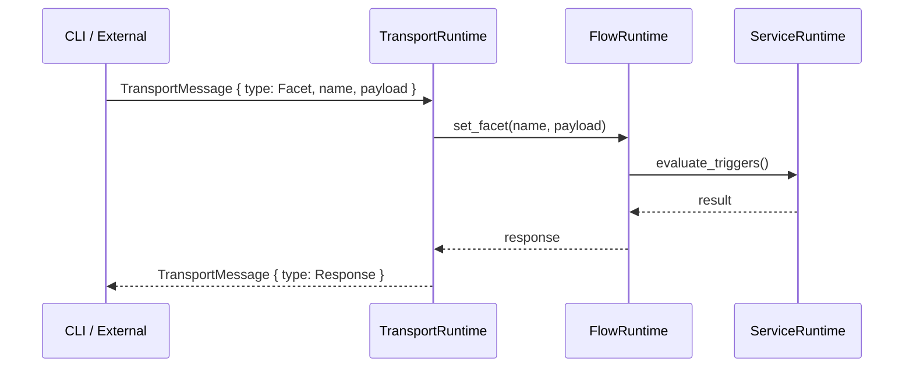

[[IPC]] defines the message protocols for [[Communication]] with and within the [[Rind]] daemon. There are two message formats: API for CLI-to-daemon interaction and Transport Protocols for entity-level transport.

## API IPC



This is the entry to the base API that exposes IPC actions over via a UDS. It's what the [[CLI]] uses for communication. 

The daemon's socket path is read from `RIND_SOC_PATH` (default `/tmp/rind.sock`). Each message is framed with a 4-byte magic (`b"RIND"`) and 4-byte length prefix over the UDS stream.

## Transport Protocols
A special transport method tied to [[Flow]] items or [[Services]] that open route to talk to rind as an internal state via:
- **UDS**
- **SHM**
- **STDIO**

## Transport on Services

```toml
[[service]]
name = "stdio-service"
run.exec = "/usr/bin/stdio-service"
transport = "stdio"                    # stdin/stdout TransportMessage protocol

[[service]]
name = "shm-service"
run.exec = "/usr/bin/shm"
transport = "shm"                      # shared memory

[[service]]
name = "uds-service"
run.exec = "/usr/bin/uds-service"
transport = { id = "uds", options = ["detached=true"] }
```

## Transport on Facets and Impulses

```toml
[[facet]]
name = "transport_state"
payload = "string"
subscribers = [{ id = "uds", options = ["detached=true"], permissions = ["any"] }]

[[impulse]]
name = "demo_ping"
payload = "string"
subscribers = ["uds"]
```

## Transport Protocol IDs

| Protocol | Identifier       | Description                                  |
| -------- | ---------------- | -------------------------------------------- |
| stdio    | `"stdio"`        | Over stdin/stdout as line-delimited messages |
| UDS      | `"uds"`          | Unix domain socket                           |
| SHM      | `"shm"`          | Shared memory segment                        |
| Env      | `"env"`          | Via environment variables                    |
| Args     | `"args"`         | Via command-line arguments                   |
| Route    | `"route:<name>"` | Named transport route                        |

## Environment Transport Options

```toml
transport = { id = "env", options = ["DEMO_STATE=state:my-group:transport_state"] }
```

The `state:<group>:<facet>` pattern resolves a facet's current string value. The `facet:<group>:<facet>` pattern uses the full facet payload. Dynamic references `facet:$` and `facet:$/key` resolve to the current facet value or its `key` field in branching contexts.

## Args Transport Options

```toml
transport = { id = "args", options = ["--from-facet", "facet:my-group:transport_state"] }
```

## Transport Routes

Named transport routes can be defined for complex routing:

```toml
[[transport-route]]
name = "api-route"
protocol = { id = "uds", options = ["/var/sink/api.sock"] }
```


See also: [[Services]], [[IPC]], [[CLI]]
