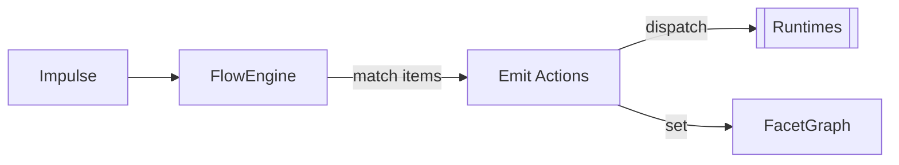

[[Impulses]] are the action side of [[Flow]]. Unlike [[Facets]], an impulse is ephemeral and [[Persistence#Transience|transient]]: fire it, trigger evaluation, it's gone. If a facet is a fact, an impulse is a shout.




## Impulse as Concept

An impulse answers "what just happened?". Unlike facets, impulses carry no state. However, they arrive, trigger evaluation, and are consumed.

Examples:
- `service:httpd_start`: request to start a service
- `service:httpd_exited`: notification that a service exited
- `network:link_down`: network link status change
- `timer:backup_expired`: a timer fired

## Impulse Structure

```toml
[[impulse]]
name = "my_signal"
payload = "string"

[[impulse]]
name = "my_signal_2"
payload = "json"
subscribers = ["uds"]
```


| Field         | Type   | Purpose                                                                 |
| ------------- | ------ | ----------------------------------------------------------------------- |
| `name`        | string | Unique impulse name, `group:entity` convention                          |
| `payload`     | string | Payload type: `json`, `string`, `bytes`, `none`                         |
| `after`       | array  | [[Architecture/Flow#FlowItem\|FlowItem]] conditions that must be active |
| `branch`      | array  | JSON key specs for branching                                            |
| `subscribers` | array  | Transport subscribers notified on fire                                  |
| `broadcast`   | array  | Named broadcast targets                                                 |
| `permissions` | array  | [[Permissions\|Permission]] names required to emit                      |


## Impulse Matching

The `start-on` field matches impulses by name:

```toml
[[service]]
name = "listener"
run.exec = "/usr/bin/listener"
start-on = [{ impulse = "my_signal" }]
```

## Triggering Impulse

```toml
# String payload
on-start = [{ impulse = "notify:message", payload = "hello" }]

# JSON payload
on-start = [{ impulse = "notify:event", payload = { key = "value", count = 42 } }]

# No payload
on-start = [{ impulse = "notify:toggle" }]
```

## Subscribers

Like facets, impulses can have transport subscribers:

```toml
[[impulse]]
name = "demo_ping"
payload = "string"
subscribers = ["uds"]
```

When fired, subscribers receive a [[IPC#TransportMessage|TransportMessage]] with type `"impulse"`.


See also: [[Flow]], [[Facets]], [[Persistence]], [[Reactivity]]