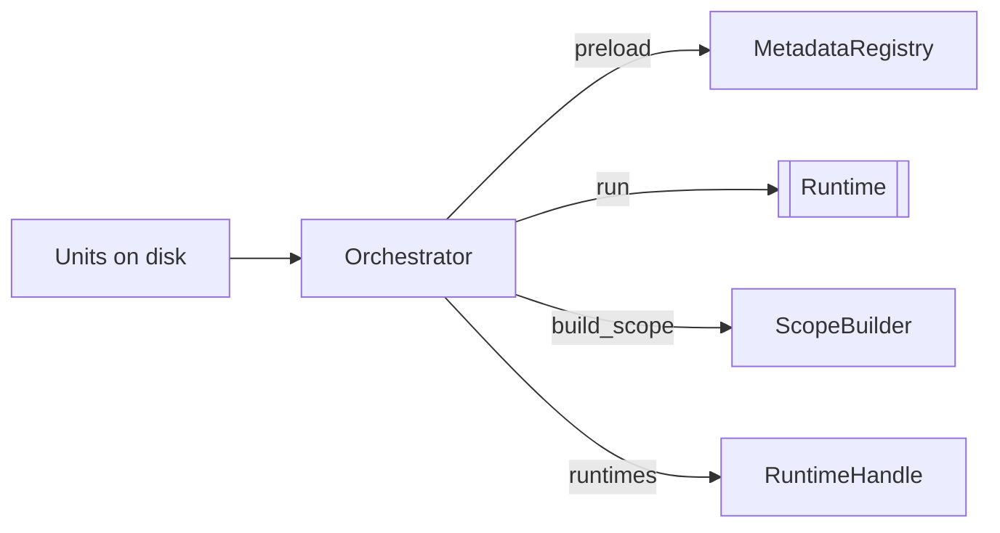

[[Orchestrators]] connect [[Units]] to [[Runtimes]]. They are the discovery and wiring layer as they read unit definitions from disk, build indexes, register metadata, and provide runtimes for the [[Boot]] cycle.





## Orchestrator Execution Model

```rust
pub trait Orchestrator: Send {
    fn id(&self) -> &str;
    fn depends_on(&self) -> &[&str];
    fn when(&self) -> OrchestratorWhen<'static>;
    fn build_scope(&mut self, _builder: &mut ScopeBuilder) -> Result<Void, CoreError>;
    fn preload(&mut self, _ctx: &mut OrchestratorContext<'_>) -> Result<Void, CoreError>;
    fn run(&mut self, ctx: &mut OrchestratorContext<'_>) -> Result<Void, CoreError>;
    fn runtimes(&self) -> Vec<Box<dyn Runtime>>;
}
```

### `id()`
Unique string identifier. Used for dependency resolution and logging.

### `depends_on()`
Returns a list of orchestrator IDs that must run before this one. The [[Architecture/Boot#BootEngine|BootEngine]] uses this for topological ordering.

### `when()`
Specifies which cycle-phase pairs(from [[Boot#BootCycles|BootCycles]]) this orchestrator executes in:

```rust
pub struct OrchestratorWhen<'a> {
    pub cycle: &'a [BootCycle],
    pub phase: BootPhase,
}
```

### `build_scope()`
Injects types into the runtime [[Context#Runtime Scope|ScopeBuilder]] so downstream orchestrators and runtimes can receive them. This runs during the Collect/Start phase, before any `preload()` or `run()`. This is the DI mechanism (not to be confused with metadata [[Scopes]]).

### `preload()`
Called during the Collect cycle. Used for metadata discovery such as: reading unit files, building indexes, registering types with [[Registry#MetadataRegistry|MetadataRegistry]].

### `run()`
Called during Runtime and PostRuntime cycles. The primary execution hook. Receives an [[Context#OrchestratorContext|OrchestratorContext]] with access to metadata, [[Runtimes#RuntimeHandle|RuntimeHandle]], [[Registry#InstanceMap|Instances]], and [[Resources]].

### `runtimes()`
Returns [[Runtimes]] provided by this orchestrator. These are registered with the runtime engine by the [[Architecture/Boot#BootEngine|BootEngine]] during the Runtime cycle.

See also: [[Boot]], [[Context]], [[Scopes]], [[Units]]
