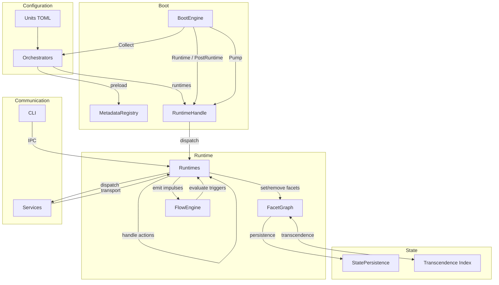

Here is high-level map of how [[Rind]]'s components fit together:

---

## The Big Picture



---

## Component Map

| Layer | Component | Role | Deep Dive |
| ----- | --------- | ---- | --------- |
| **Configuration** | [[Units]] | TOML definitions for everything the system manages | [[Units]] |
| **Configuration** | [[Entities]] | Models built from unit metadata (services, facets, etc.) | [[Entities]] |
| **Discovery** | [[Orchestrators]] | Read units, build indexes, register metadata, provide runtimes | [[Orchestrators]] |
| **Discovery** | [[Registry]] | Central database, metadata and instance stores | [[Registry]] |
| **Sequencing** | [[Boot]] | Boot engine that sequences cycles and enters the pump loop | [[Boot]] |
| **Reactivity** | [[Flow]] | Core engine: watches events, evaluates facets, emits impulses | [[Flow]] |
| **Reactivity** | [[Facets]] | Persistent, branchable state facts ("what is") | [[Facets]] |
| **Reactivity** | [[Impulses]] | Ephemeral events ("what happened") | [[Impulses]] |
| **Execution** | [[Runtimes]] | Active layer: handle actions, manage lifecycles | [[Runtimes]] |
| **Execution** | [[Services]] | Processes managed by the system | [[Services]] |
| **Execution** | [[Timers]] | One-shot delayed triggers | [[Timers]] |
| **Execution** | [[Sockets]] | Communication endpoints (UDS, TCP, UDP) | [[Sockets]] |
| **Execution** | [[Networking]] | Network interface management | [[Networking]] |
| **Execution** | [[Mounts]] | Filesystem mount points | [[Mounts]] |
| **Communication** | [[IPC]] | Message protocols for daemon interaction | [[IPC]] |
| **Context** | [[Context]] | Contracts between layers for what each participant can see | [[Context]] |
| **Scoping** | [[Scopes]] | Metadata namespaces. per-user, per-domain isolation | [[Scopes]] |
| **Scoping** | [[Users]] | User sessions and identity management | [[Users]] |
| **Access** | [[Permissions]] | Entity-based access control | [[Permissions]] |
| **Extensibility** | [[Plugins]] | Plugin system for custom orchestrators, runtimes, and entity types | [[Plugins]] |
| **Variables** | [[Variables]] | Reusable run definitions and template substitution | [[Variables]] |

---

## Data Flow

### 1. Boot -> Live State

Units are loaded from disk by orchestrators during the **Collect** cycle. Each unit is parsed into metadata, indexed, and registered in the [[Registry#MetadataRegistry|MetadataRegistry]]. Orchestrators then provide [[Runtimes|Runtimes]] which are registered with the [[Runtimes#RuntimeHandle|RuntimeHandle]]. The **Runtime** cycle activates these runtimes. After boot, the **Pump** cycle runs continuously, driving all reactivity.

### 2. Event -> Reaction

When something changes -> a service starts, a facet is set, a timer fires -> the [[Flow]] engine evaluates all registered [[Flow#FlowItem|FlowItems]] against the current [[Facets]] state. Matching items trigger [[Flow#Trigger|Triggers]] which dispatch actions to the appropriate [[Runtimes|Runtime]]. Runtimes handle these actions and may set new facets, start/stop services, or emit further impulses, creating a reactive chain.

### 3. State -> Continuity

[[Facets]] can be configured for [[Persistence|persistence]]. The [[Flow#FacetGraph|FacetGraph]] serializes facet state to disk via [[Facets#StatePersistence|StatePersistence]]. On reboot, persisted facets are restored, and services that depend on them via [[Facets#After: Transcendence|transcendence]] automatically reactivate. Therefore, preserving continuity across reboots.

### 4. Branching -> Instances

Facets support [[Branching|branching]]: a single facet can hold multiple instances keyed by payload fields. When a [[Services|service]] declares `branching`, it watches a facet for new branches and spawns a unique instance per branch. When a branch is removed, the corresponding instance stops. This is how per-user sessions, per-TTY services, and other multi-instance patterns emerge naturally from state.

---

## The Scope System

[[Scopes]] allow for metadata isolation. The built-in `"static"` scope holds all system-level units. Dynamic scopes (created at runtime via IPC or by the user orchestrator) provide per-user or per-domain namespaces with their own units, facets, and lifecycle.

```
group:name@scope
│    │     │
│    │     └── metadata namespace
│    └── entity name
└── unit group (file stem)
```

---

## Context Boundaries

[[Context]] defines what each layer can access:

- **Orchestrators** get mutable metadata, the instance map, and the runtime handle, but no event bus or lifecycle queue.
- **Runtimes** get a scoped view, the instance registry, resources, the event bus, and a lifecycle queue but no mutable metadata.

This separation ensures that discovery and execution remain decoupled while sharing the same underlying state.

---

## Plugin Architecture

[[Plugins]] extend Rind without modifying core code. Plugins can:

- Register new orchestrators and runtimes
- Introduce custom entity types via the `#[model]` macro
- Hook into the [[Plugins#Extension System|Extension System]] for runtime extensibility
- Declare capabilities as bitflags (orchestrators, runtimes, IPC, extensions, initrd)

---

## See Also

- [[Rind]]: project overview and philosophy
- [[Architecture/Boot|Boot]]: boot sequence deep dive
- [[Architecture/Flow|Flow]]: reactive engine deep dive
- [[Architecture/Services|Services]]: service lifecycle deep dive
- [[Philosophy/The Awkward Philosophy|The Awkward Philosophy]]: design philosophy
