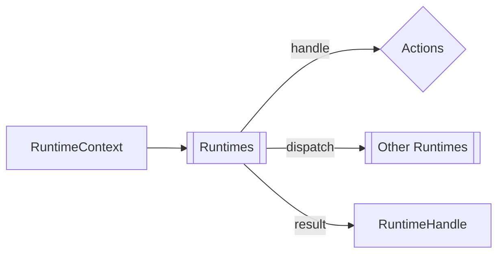

[[Runtimes]] are the active layer of [[Rind]]. The [[Architecture/Boot#BootEngine|BootEngine]] provides them through [[Orchestrators]], and they [[Communication|communicate]] by dispatching actions to each other via [[#RuntimeHandle]]. 





```rust
pub trait Runtime: Send {
    fn id(&self) -> &str;
    fn handle(
        &mut self,
        action: &str,
        payload: RuntimePayload,
        ctx: &mut RuntimeContext<'_>,
        dispatch: &RuntimeDispatcher,
        log: &LogHandle,
    ) -> Result<Option<RuntimePayload>, CoreError>;
}
```

| Method | Purpose |
|---|---|
| `id()` | Unique string identifier, matched by dispatch target |
| `handle()` | Process an action with given payload and context; may dispatch sub-actions |

## RuntimeHandle

The handle is the public interface for dispatching. It wraps an internal `RuntimeEngine` that manages a command queue. 

- `dispatch()` queues a dispatch
- `flush_context()` processes all pending commands for a given context ID
- `stop()` signals all runtimes to shut down


See also: [[Orchestrators]], [[Context]], [[Flow]], [[Services]], [[IPC]]
