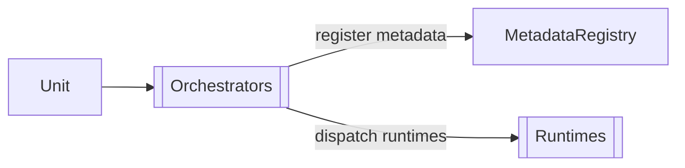

Units are description files that describe everything [[Rind]] manages. They are the [[Entities#Metadata|metadata]] layer of the [[Registry]]. 





## TOML Structure

```toml
[[service]]
name = "web"
run.exec = "/usr/bin/httpd"
restart = { max_retries = 3 }

[[facet]]
name = "ready"
payload = "string"
```

## Group Names

The file stem becomes the **group name**: `example.toml` → group `"example"`. Every entity in that file is addressable as `example:<name>`.

```toml
# example.toml → group "example"
[[service]]
name = "web_ser"
# addressable as "example:web_ser"
```


## Built-in Entity Types

| TOML section          | Rust type        | Purpose                       |
| --------------------- | ---------------- | ----------------------------- |
| `[[service]]`         | `Service`        | A process to spawn and manage |
| `[[timer]]`           | `Timer`          | A one-shot timer              |
| `[[socket]]`          | `Socket`         | A Unix/TCP/UDP socket         |
| `[[mount]]`           | `Mount`          | A filesystem mount point      |
| `[[facet]]`           | `FlowFacet`      | A persistent state fact       |
| `[[impulse]]`         | `FlowImpulse`    | An ephemeral event            |
| `[[variable]]`        | `Variable`       | A reusable run definition     |
| `[[permission]]`      | `Permission`     | An access permission          |
| `[[network]]`         | `NetworkConfig`  | A network interface           |
| `[[transport-route]]` | `TransportRoute` | A transport routing rule      |

## Mixed Types

A single unit can define multiple entity types:

```toml
[[service]]
name = "app"
run.exec = "/usr/bin/app"

[[facet]]
name = "app:status"
payload = "string"

[[impulse]]
name = "app:event"
payload = "json"

[[timer]]
name = "healthcheck"
duration = "30s"
finish = [{ impulse = "app:health:check" }]
```

