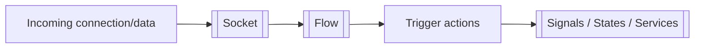
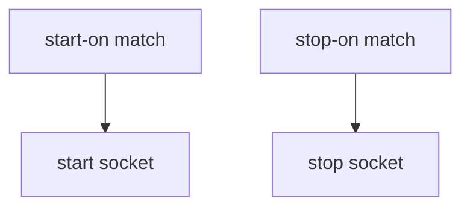
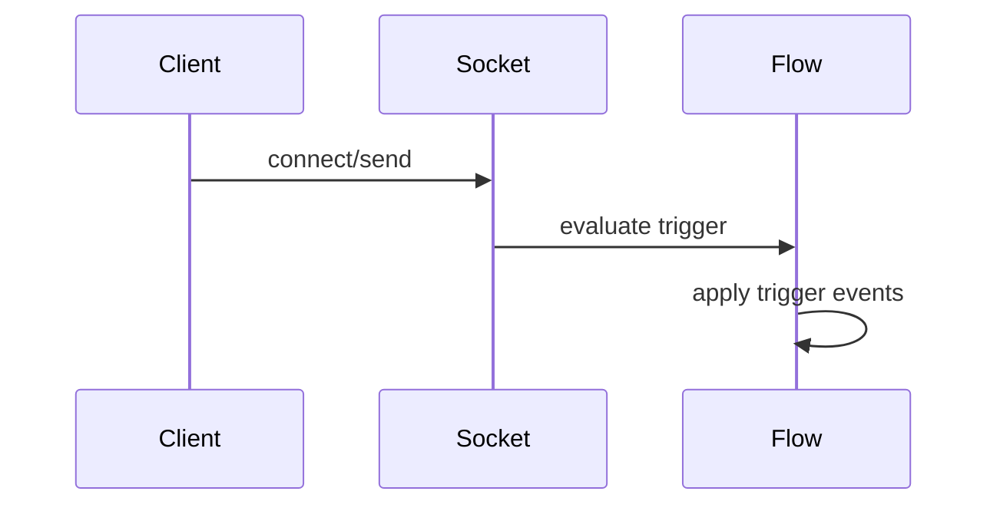
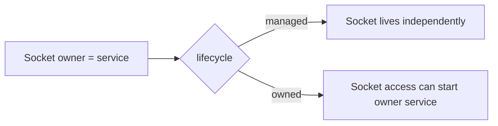

[[Sockets]] in [[Rind]] are listener definitions that expose TCP/UDP/UDS endpoints, integrate with [[Flow]] conditions, and can trigger actions when traffic arrives. Sockets can also provide inherited file descriptors to owned services.

## Core Definition

The base socket metadata defines endpoint type, listen target, and owner association.

- `name`: The unique socket name.
- `type`: Socket kind: `tcp`, `udp`, or `uds`.
- `listen`: Address or path to bind.
- `owner`: Service address that can inherit this socket (`group@name`).

```toml
[[socket]]
name = "ipcs_s"
type = "uds"
listen = "/var/sock/some.sock"
owner = "test@ipcs"
```

## Lifecycle Triggers



Sockets can be started and stopped by flow conditions.

- `start-on`: Conditions that can activate the socket.
- `stop-on`: Conditions that can deactivate the socket.
- Conditions use [[Flow]] `FlowItem` matching (see [[Common]]).

```toml
[[socket]]
name = "four_starter"
type = "uds"
listen = "/var/sock/my.sock"
start-on = [{ state = "rind@net-configured" }]
stop-on = [{ state = "rind@maintenance-mode" }]
```

## Trigger on Access



Sockets can emit side effects whenever they are accessed.

- `trigger`: List of [[Common#Trigger Objects|Trigger Objects]] executed on incoming data/access.

```toml
[[socket]]
name = "ipcs_s"
type = "uds"
listen = "/var/sock/some.sock"
trigger = [
  { signal = "test@thething", payload = "yeaaaaaaaah" }
]
```

## Ownership & FD Inheritance



Ownership links sockets to a service and enables inherited fd passing.

- `owner`: Service address (`group@service`) linked to this socket.
- `lifecycle`: `managed` (default) or `owned`.
- `owned`: socket access can trigger owner service start with socket fds.

```toml
[[socket]]
name = "four_starter"
type = "uds"
lifecycle = "owned"
listen = "/var/sock/my.sock"
owner = "else@four"
```

## Access Permissions

Incoming socket access can be permission-gated.

- `permissions`: List of permission names.
- Runtime checks peer credentials on access and clears/denies unauthorized requests.

```toml
[[socket]]
name = "admin_api"
type = "uds"
listen = "/var/sock/admin.sock"
permissions = ["services", "operators"]
```

## Lifecycle Hooks

Sockets can run side effects on activation/deactivation.

- `on-start` / `on-stop`: Trigger list executed when socket lifecycle changes.

```toml
[[socket]]
name = "api_sock"
type = "tcp"
listen = "127.0.0.1:8081"
on-start = [{ signal = "ops@socket_online", payload = "api_sock" }]
on-stop = [{ signal = "ops@socket_offline", payload = "api_sock" }]
```

## Runtime Management

Socket management over IPC can be restricted.

- `managed-by`: Permission names allowed to start/stop this socket over IPC.
- Root/system-services permission can also manage sockets.

```toml
[[socket]]
name = "shared_listener"
type = "tcp"
listen = "0.0.0.0:9000"
managed-by = ["services"]
```
