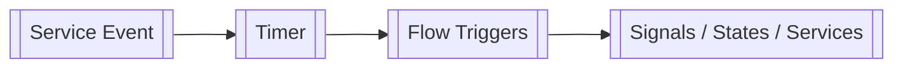
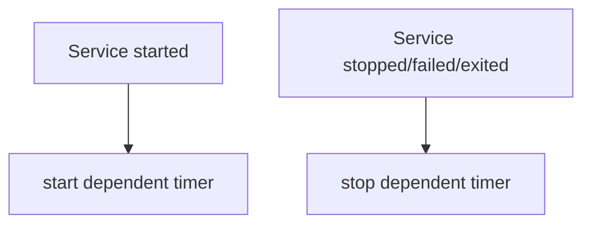
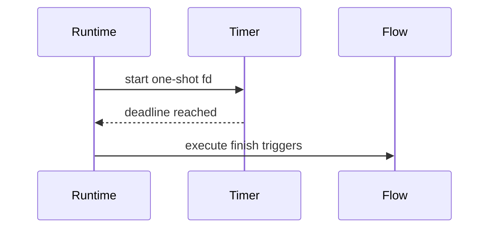

[[Timers]] in [[Rind]] are one-shot runtime schedulers that start from lifecycle conditions and execute trigger actions when duration expires. They are often used for delayed stop/start behavior tied to [[Services]].

## Core Definition

The timer metadata defines a unique name and one-shot duration.

- `name`: The unique timer name.
- `duration`: One-shot timeout value.

Supported `duration` forms:

- suffix units: `s`, `m`, `h`, `d` (for example `5s`, `10m`, `1h`)
- plain integer seconds (for example `30`)

```toml
[[timer]]
name = "timeout_four"
duration = "5s"
```

## Service-Dependent Start/Stop



Timers can bind to service lifecycle dependencies.

- `after`: List of service addresses (`group@name`).
- On dependent service start: timer starts.
- On dependent service stop/fail/exit: timer stops.

```toml
[[timer]]
name = "request_timeout"
duration = "30s"
after = ["else@four"]
```

## Expiration Triggers



When a timer expires, `finish` triggers are executed.

- `finish`: List of [[Common#Trigger Objects|Trigger Objects]].
- Common use: stop a service after timeout.

```toml
[[timer]]
name = "timeout_four"
duration = "5s"
finish = [{ service = "else@four", stop = true }]
```

## Runtime Behavior

- Timers are one-shot, not periodic.
- Starting an already-active timer is a no-op.
- After expiration, timer instance is removed automatically.

## Practical Pattern

Use timer + service together for watchdog-like control.

```toml
[[service]]
name = "four"
run.exec = "/usr/bin/ipc_so"
on-start = [{ timer = "else@timeout_four" }]

[[timer]]
name = "timeout_four"
duration = "5s"
finish = [{ service = "else@four", stop = true }]
```
